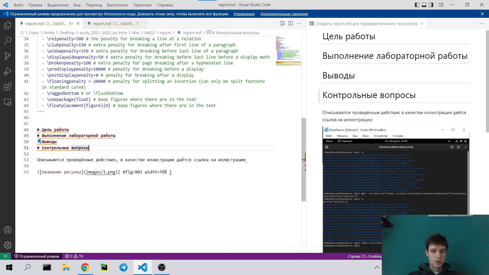
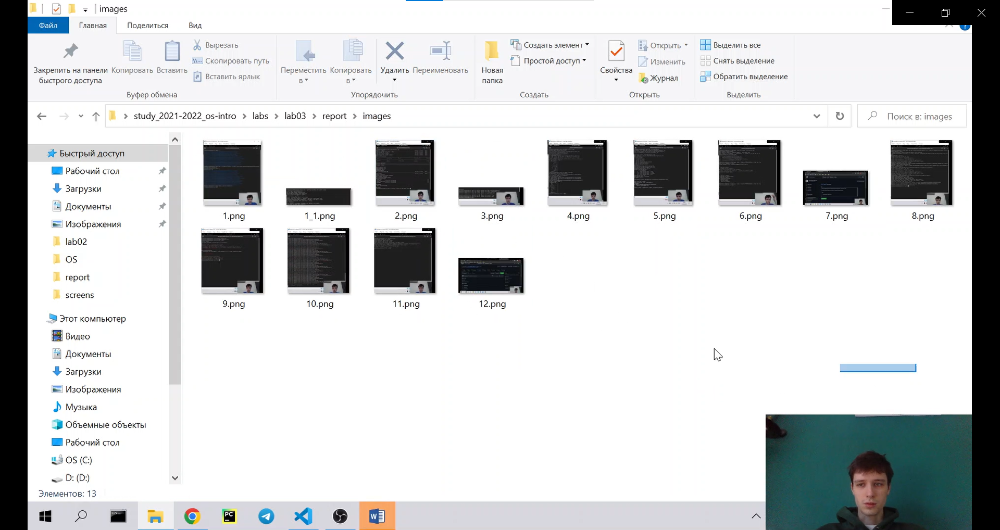
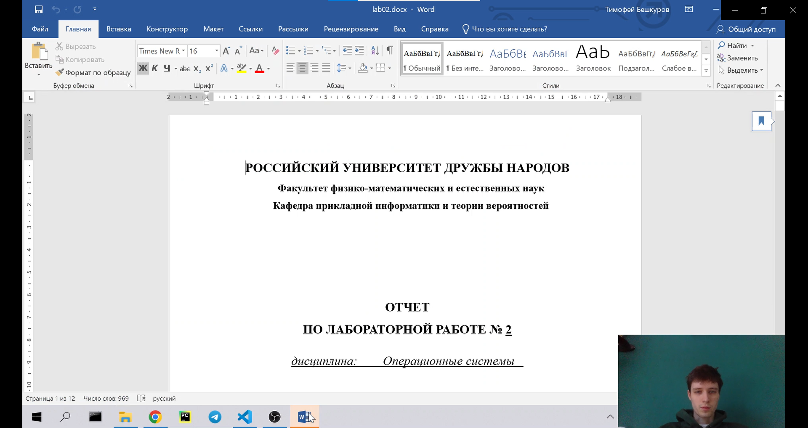
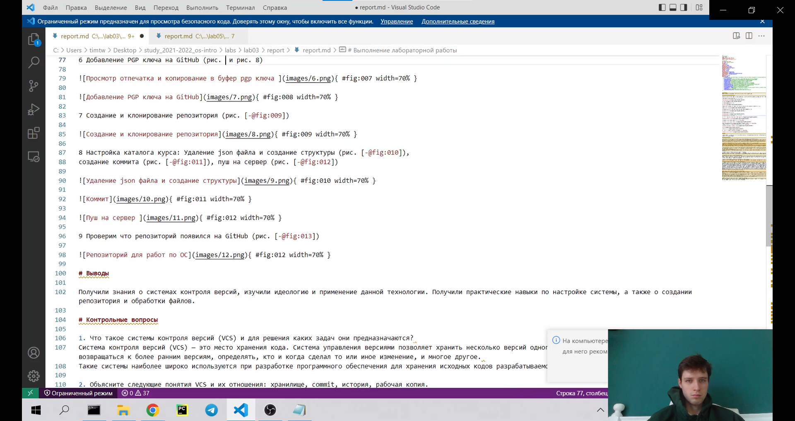
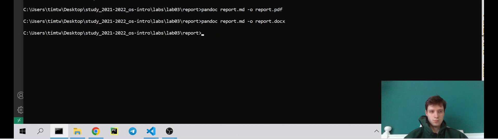

---
## Front matter
lang: ru-RU
title: Лабораторная работа №3
author: |
    Бешкуров Тимофей - студент группы НФИбд-01-21
date: 20.04.2022

## Formatting
toc: false
slide_level: 2
theme: metropolis
header-includes: 
 - \metroset{progressbar=frametitle,sectionpage=progressbar,numbering=fraction}
 - '\makeatletter'
 - '\beamer@ignorenonframefalse'
 - '\makeatother'
aspectratio: 43
section-titles: true
---

# Markdown 

## Цель работы

- Научиться оформлять отчёты с помощью легковесного языка разметки Markdown.

## Задание 

- Сделайте отчёт по предыдущей лабораторной работе в формате Markdown.
- В качестве отчёта просьба предоставить отчёты в 3 форматах: pdf, docx и md (в архиве)

## Теоретическое введение

Markdown — облегчённый язык разметки, созданный с целью обозначения форматирования в простом тексте, с максимальным сохранением его читаемости человеком, и пригодный для машинного преобразования в языки для продвинутых публикаций (HTML, Rich Text и других).

## Выполнение лабораторной работы

1. Создали файл <i>report.md</i> и создали в нем шаблон отчета

## 

2. Создали папку <i>images</i> для хранения картинок и перенесли туда скриншоты из второй лабороторной работы.

##

3. Открыли отчет второй лабораторной работы в формате docx.

##

4. Перенесли отчет из docx в отчет в формате Markdown.

##

5. Конвертируем md файл в pdf и docx используя <i>pandoc</i>.

## Вывод

Научились использовать разметку Markdown для написания отчетов, а также использование pandoc для конвертации md в pdf и docx. 