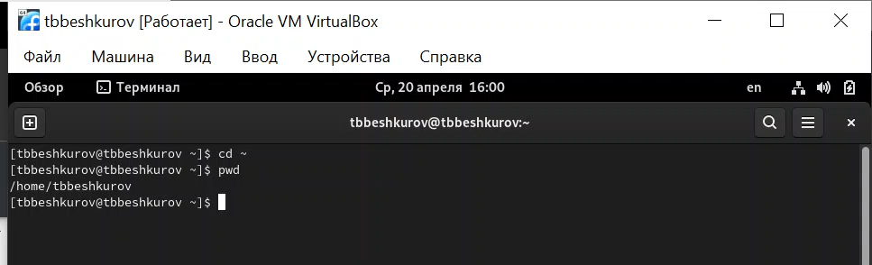
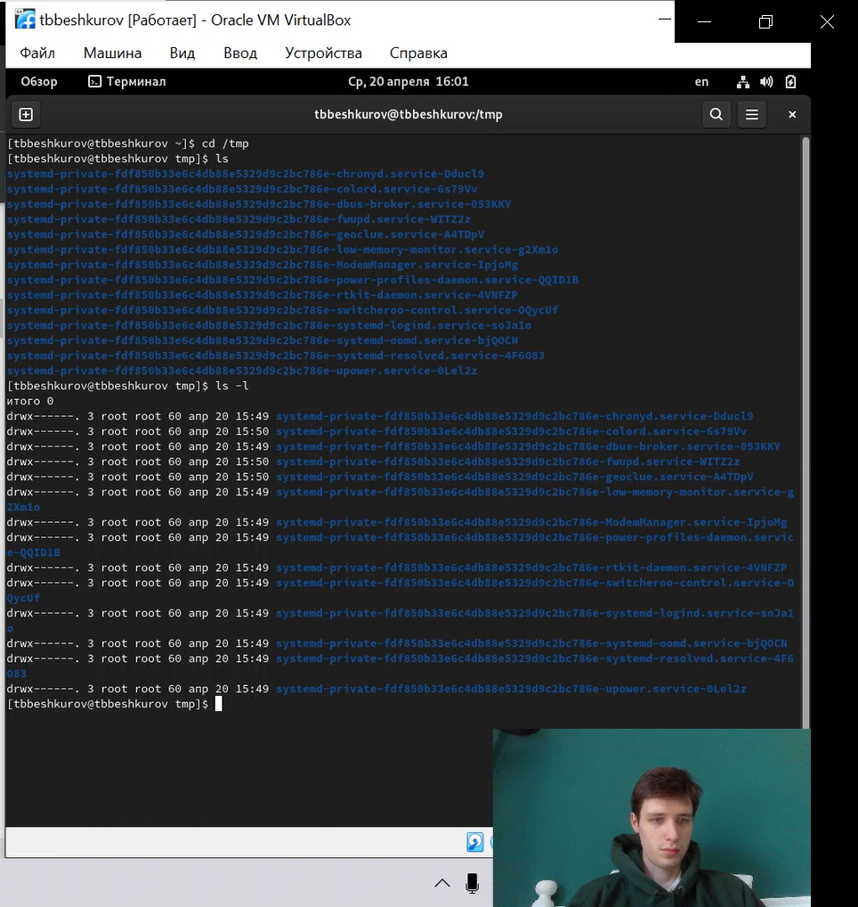
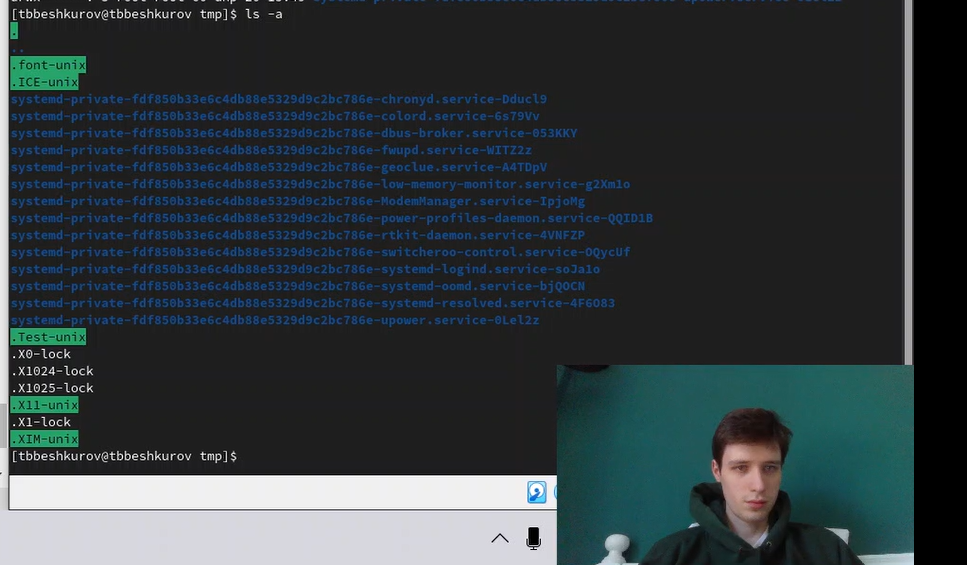
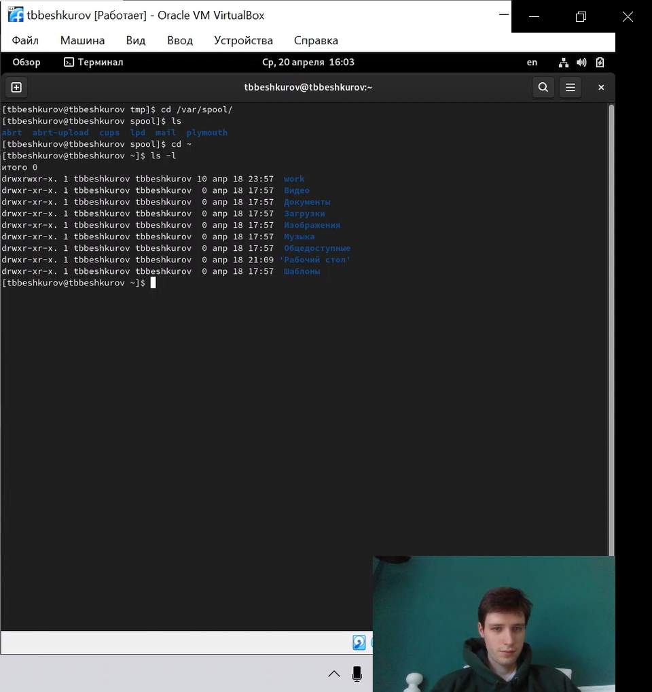
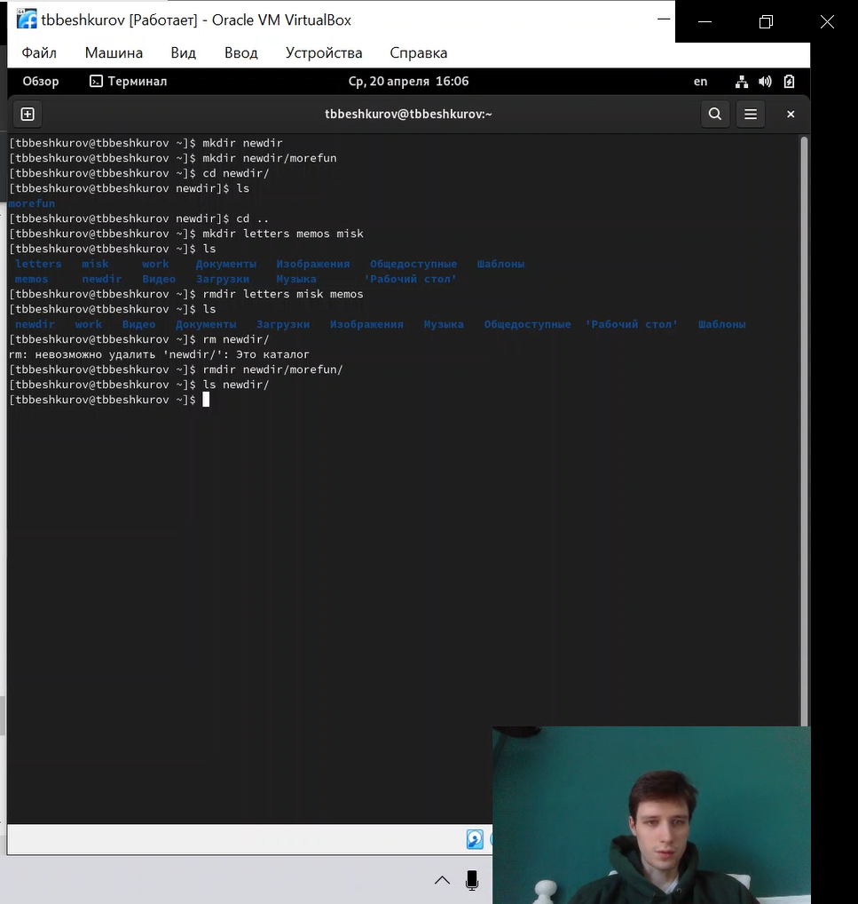
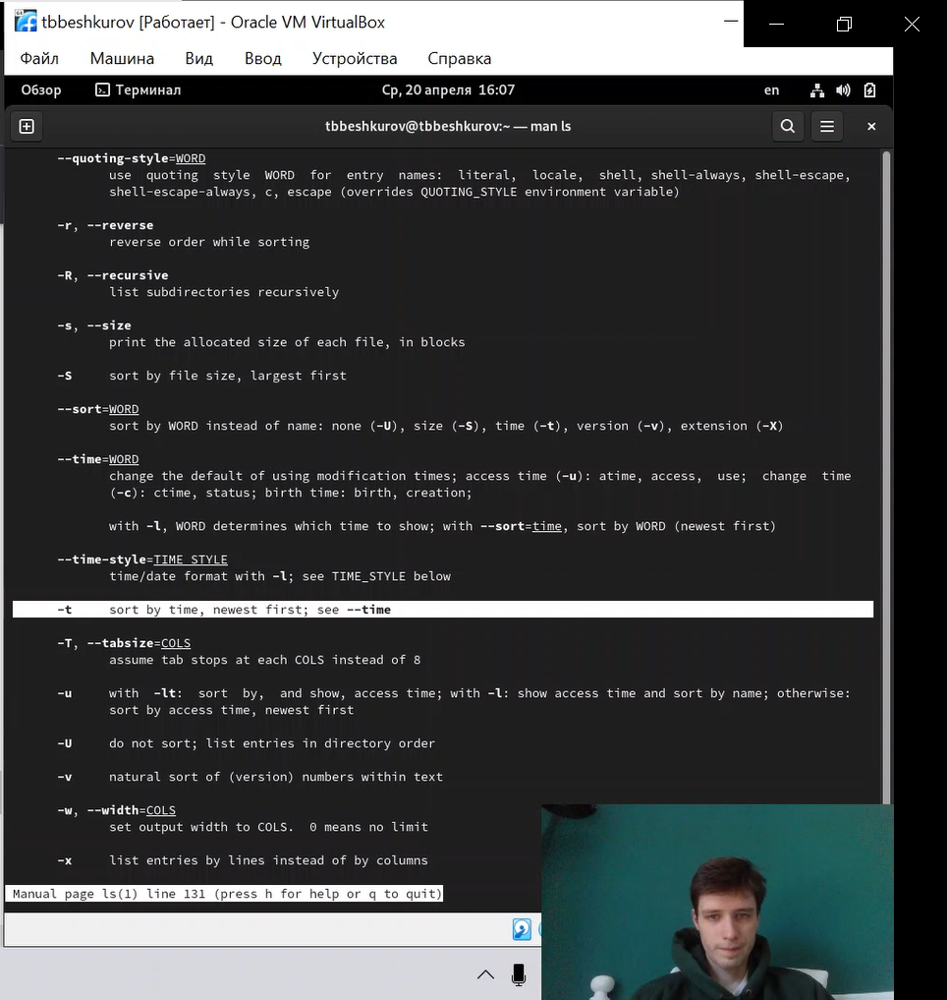
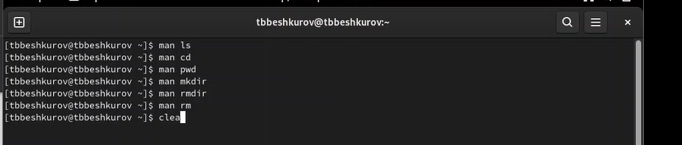
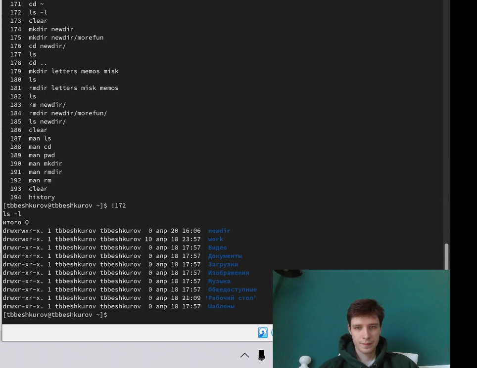
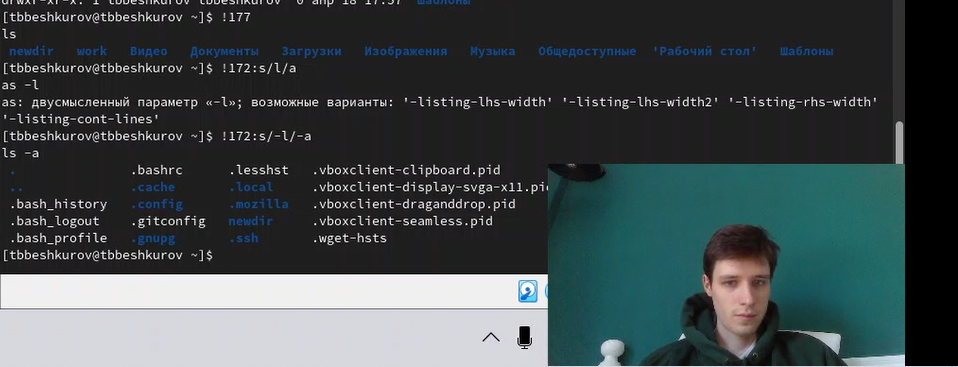

---
# Front matter
lang: ru-RU
title: "Лабораторная работа 4"
subtitle: "Основы интерфейса взаимодействия пользователя с системой Unix на уровне командной строки"
author: "Бешкуров Тимофей Борисович"

# Formatting
toc-title: "Содержание"
toc: true # Table of contents
toc_depth: 2
fontsize: 12pt
linestretch: 1.5
papersize: a4paper
documentclass: scrreprt
polyglossia-lang: russian
polyglossia-otherlangs: english
mainfont: PT Serif
romanfont: PT Serif
sansfont: PT Sans
monofont: PT Mono
mainfontoptions: Ligatures=TeX
romanfontoptions: Ligatures=TeX
sansfontoptions: Ligatures=TeX,Scale=MatchLowercase
monofontoptions: Scale=MatchLowercase
indent: true
pdf-engine: lualatex
header-includes:
  - \linepenalty=10 # the penalty added to the badness of each line within a paragraph (no associated penalty node) Increasing the value makes tex try to have fewer lines in the paragraph.
  - \interlinepenalty=0 # value of the penalty (node) added after each line of a paragraph.
  - \hyphenpenalty=50 # the penalty for line breaking at an automatically inserted hyphen
  - \exhyphenpenalty=50 # the penalty for line breaking at an explicit hyphen
  - \binoppenalty=700 # the penalty for breaking a line at a binary operator
  - \relpenalty=500 # the penalty for breaking a line at a relation
  - \clubpenalty=150 # extra penalty for breaking after first line of a paragraph
  - \widowpenalty=150 # extra penalty for breaking before last line of a paragraph
  - \displaywidowpenalty=50 # extra penalty for breaking before last line before a display math
  - \brokenpenalty=100 # extra penalty for page breaking after a hyphenated line
  - \predisplaypenalty=10000 # penalty for breaking before a display
  - \postdisplaypenalty=0 # penalty for breaking after a display
  - \floatingpenalty = 20000 # penalty for splitting an insertion (can only be split footnote in standard LaTeX)
  - \raggedbottom # or \flushbottom
  - \usepackage{float} # keep figures where there are in the text
  - \floatplacement{figure}{H} # keep figures where there are in the text
---

# Цель работы

Приобретение практических навыков взаимодействия пользователя с системой посредством командной строки.

# Задание 

1. Определите полное имя вашего домашнего каталога. Далее относительно этого каталога будут выполняться последующие упражнения.
2. Выполните следующие действия:
- Перейдите в каталог /tmp.
- Выведите на экран содержимое каталога /tmp. Для этого используйте команду ls
с различными опциями. Поясните разницу в выводимой на экран информации.
- Определите, есть ли в каталоге /var/spool подкаталог с именем cron?
- Перейдите в Ваш домашний каталог и выведите на экран его содержимое. Определите, кто является владельцем файлов и подкаталогов?
3. Выполните следующие действия:
- В домашнем каталоге создайте новый каталог с именем newdir.
- В каталоге ~/newdir создайте новый каталог с именем morefun.
- В домашнем каталоге создайте одной командой три новых каталога с именами
letters, memos, misk. Затем удалите эти каталоги одной командой.
- Попробуйте удалить ранее созданный каталог ~/newdir командой rm. Проверьте,
был ли каталог удалён.
- Удалите каталог ~/newdir/morefun из домашнего каталога. Проверьте, был ли
каталог удалён.
4. С помощью команды man определите, какую опцию команды ls нужно использовать для просмотра содержимое не только указанного каталога, но и подкаталогов,
входящих в него.
5. С помощью команды man определите набор опций команды ls, позволяющий отсортировать по времени последнего изменения выводимый список содержимого каталога
с развёрнутым описанием файлов.
6. Используйте команду man для просмотра описания следующих команд: cd, pwd, mkdir,
rmdir, rm. Поясните основные опции этих команд.
7. Используя информацию, полученную при помощи команды history, выполните модификацию и исполнение нескольких команд из буфера команд.

# Выполнение лабораторной работы

1. Определим полноый путь домашнего каталога (рис. 1)

{ #fig:001 width=70% }

2. Перход в каталог <i>tmp</i>. Команда ls - просмотр содержимого каталога (рис. 2), команда ls -l - расширенный просмотр каталога (рис. 2) и команда ls -a - просмотр содержимого каталога вместе со скрытыми файлами (рис. 3)

{ #fig:002 width=70% }

{ #fig:003 width=70% }

Переход в каталог /var/spool/ и проверка наличия подкаталога cron (рис. 4). Переход в домашний каталог и просмотр его содержимого с помощью команды ls -l, для того чтобы определить кто является владельцем (рис. 4). Ответ: user tbbeshkurov

{ #fig:004 width=70% }

3. Создание каталога newdir. Создание каталога newdir/morefun. Cоздание одной командой три новых каталога с именами letters, memos, misk, и их удаление одной командой. Попытка удаления каталога newdir командой rm не вышло, так как мы не указали аргумент -r (recursive). Удаление каталога newdir/morefun и проверка уго удаления (каталог newdir пуст) (рис. 5)

{ #fig:005 width=70% }

4. С помощью команды man определите, какую опцию команды ls нужно использовать для просмотра содержимое не только указанного каталога, но и подкаталогов, входящих в него. (рис. 6)

{ #fig:006 width=70% }

5. С помощью команды man определите набор опций команды ls, позволяющий отсортировать по времени последнего изменения выводимый список содержимого каталога с развёрнутым описанием файлов. (рис. 7)

{ #fig:007 width=70% }

6. Используйте команду man для просмотра описания следующих команд: cd, pwd, mkdir, rmdir, rm. (рис 8)

{ #fig:008 width=70% }

7. Используя команду history посмотрим на последние команды и вызовем команду 172 (рис. 9)

{ #fig:009 width=70% }

Вызов команды 177 и модификация команды 172: замена -l на -a (рис. 10) 

{ #fig:010 width=70% }

# Вывод

Освоили основные команды командной строки: man, pwd, ls, cd и др.

# Контрольные вопросы

1. Что такое командная строка?
Ответ: Командная строка (консоль или Терминал) – это специальная программа, которая позволяет управлять компьютером путем ввода текстовых команд с клавиатуры.

2. При помощи какой команды можно определить абсолютный путь текущего каталога? Приведите пример.
Ответ: При помощи команды pwd можно определить абсолютный путь текущего каталога.

3. При помощи какой команды и каких опций можно определить только тип файлов и их имена в текущем каталоге? Приведите примеры.
Ответ: При помощи команды ls -F можно определить только тип файлов и их имена в текущем каталоге.

4. Какие файлы считаются скрытыми? Как получить информацию о скрытых файлах? Приведите примеры.
Ответ: Файл считается скрытым, если его название начинается с символа точка «.». Например, «.myfile». Обычно такие файлы используются приложениями для хранения настроек, конфигураций и другой информации, которую нужно скрыть от пользователя. Чтобы просмотреть скрытые файлы в каталоге необходимо ввести команду ls -a 

5. При помощи каких команд можно удалить файл и каталог? Можно ли это сделать одной и той же командой? Приведите примеры. 
Ответ: При помощи команд rm и rmdir можно удалить файл и каталог. Это нельзя сделать одной и той же командой. rmdir используется, чтобы удалить пустой каталог. rm используется, чтобы удалить непустые файлы или целые деревья каталогов.

6. Как определить, какие команды выполнил пользователь в сеансе работы? 
Ответ: При помощи команды history.

7. Каким образом можно исправить и запустить на выполнение команду, которую пользователь уже использовал в сеансе работы? Приведите примеры.
Ответ: С помощью следующей команды: !<номер_команды>:s/<что_меняем>/<на_что_меняем> Например: history 3 ls -a . !3:s/a/F ls -F

8. Можно ли в одной строке записать несколько команд? Если да, то как? Приведите примеры Ответ: В одной строке можно записать несколько команд. Если требуется выполнить последовательно несколько команд, записанный в одной строке, то для этого используется символ точка с запятой. Пример: cd; ls.

9. Что такое символ экранирования? Приведите примеры использования этого символа.
Ответ: Экранирующий символ сообщает интерпретатору, что следующий за ним символ должен восприниматься как обычный символ. Пример: echo "Привет" # Привет echo "Он сказал: "Привет"." # Он сказал: "Привет".

10. Какая информация выводится на экран о файлах и каталогах, если используется опция l в команде ls?
Ответ: Если используется опция l в команде ls, то на экран выводится подробный список, в котором будет отображаться владелец, группа, дата создания, размер и другая информация о файлах и каталогах.

11. Что такое относительный путь к файлу? Приведите примеры использования относительного и абсолютного пути при выполнении какой-либо команды.
Ответ: Относительный путь – это путь к файлу относительно текущей папки. При использовании команды pwd на экран выведется абсолютный путь текущей директории. Пример: ~ = /home/tbbeshkurov. Первое относительный, второе абсолютный

12. Как получить информацию об интересующей вас команде?
Ответ: С помощью команды man.

13. Какая клавиша или комбинация клавиш служит для автоматического дополнения вводимых команд.
Ответ: Клавиша "Tab".