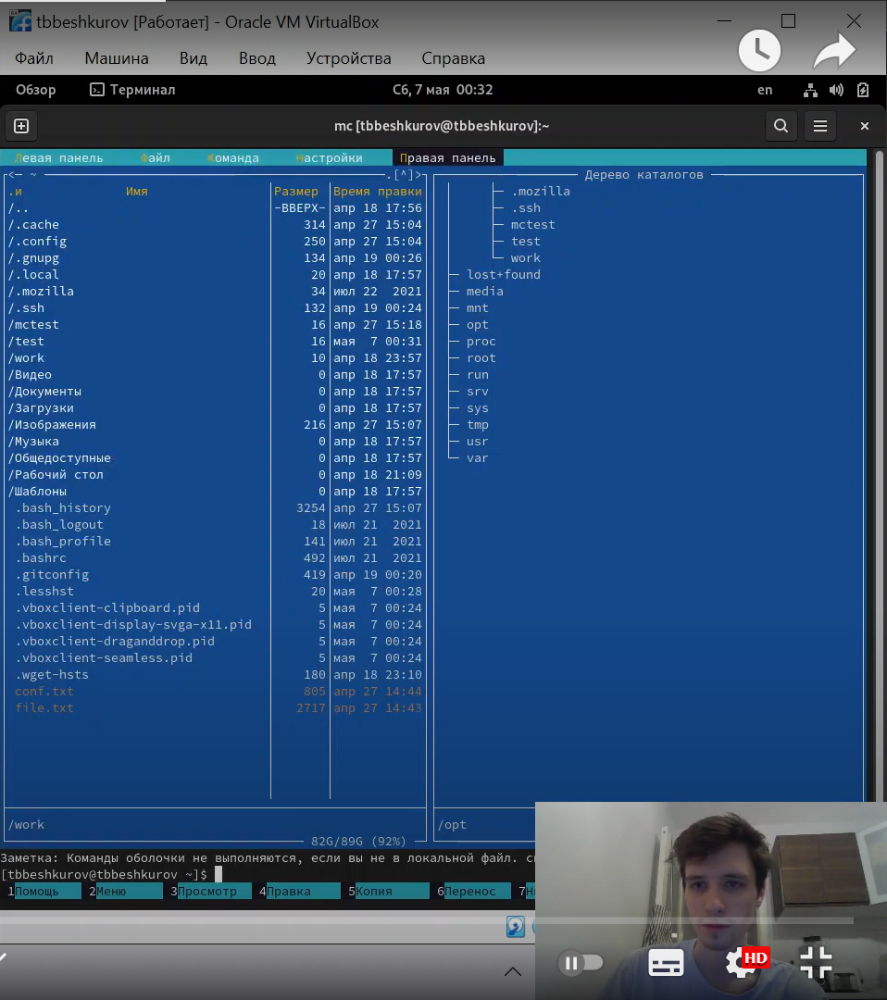
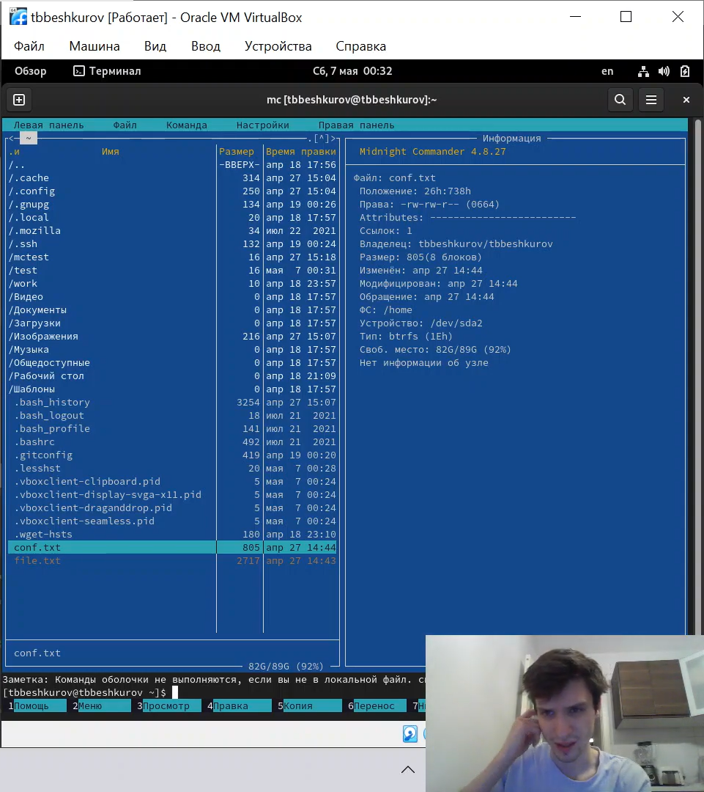
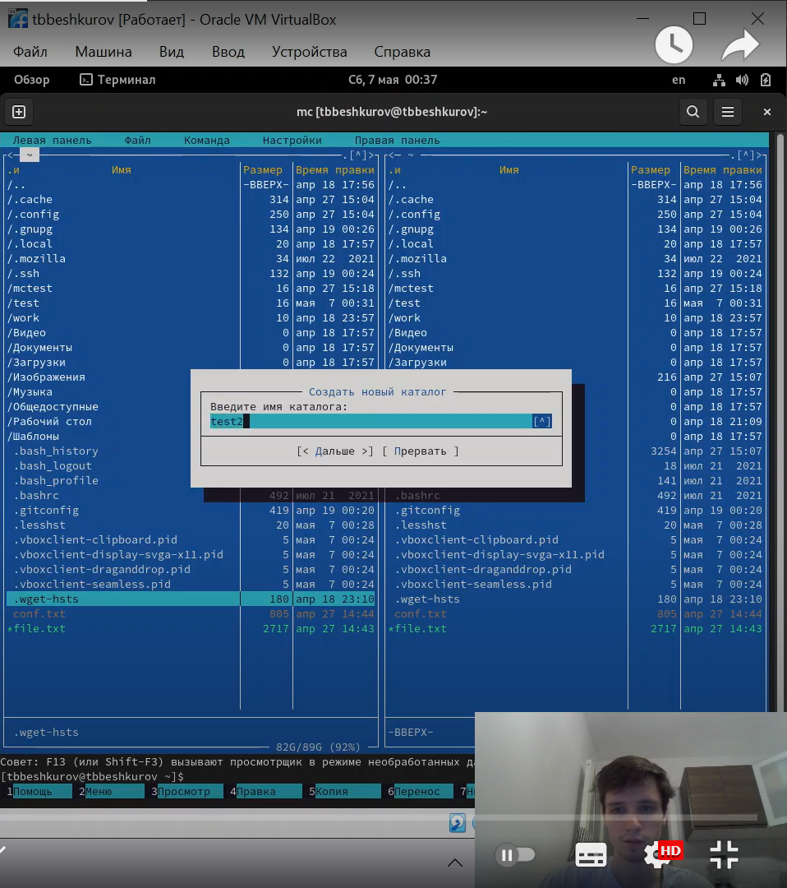
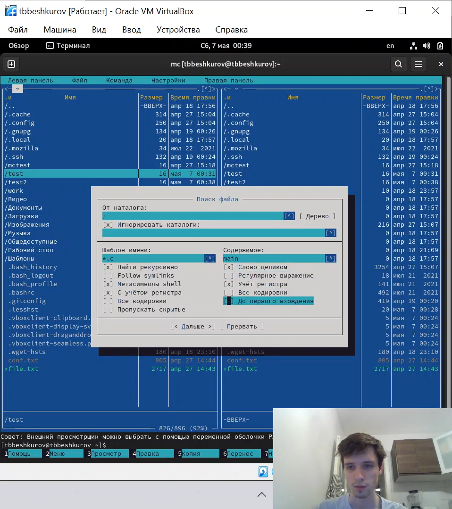
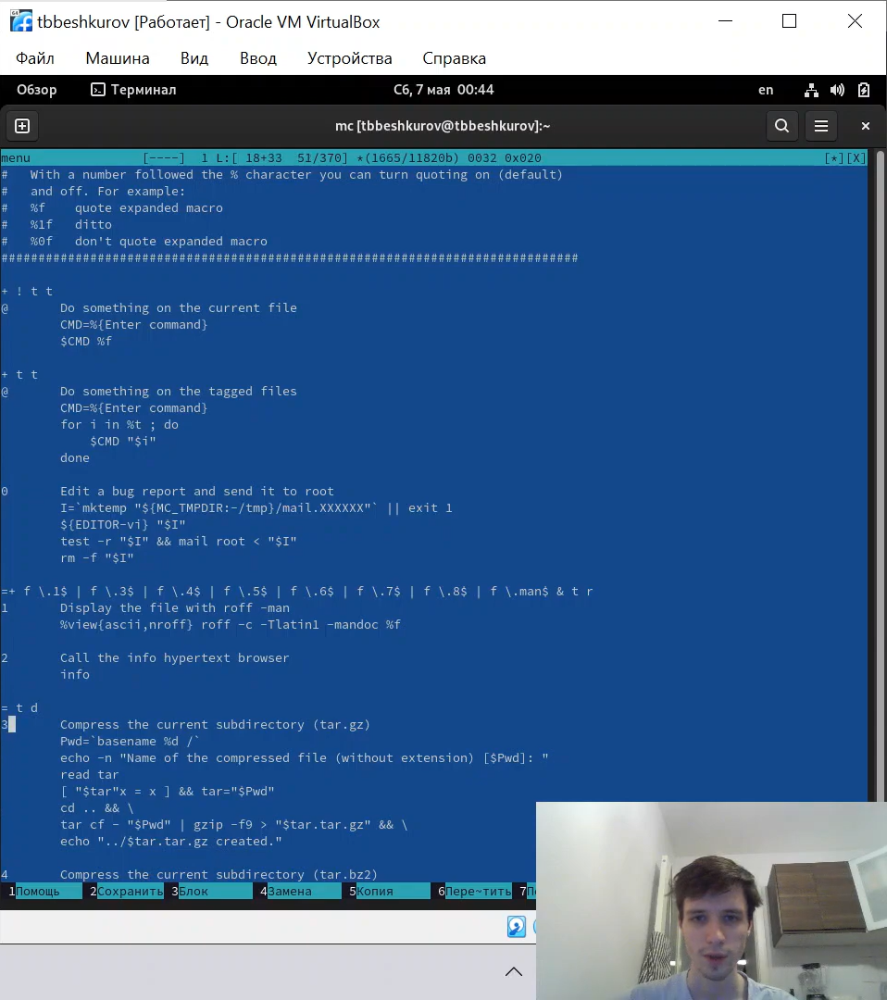
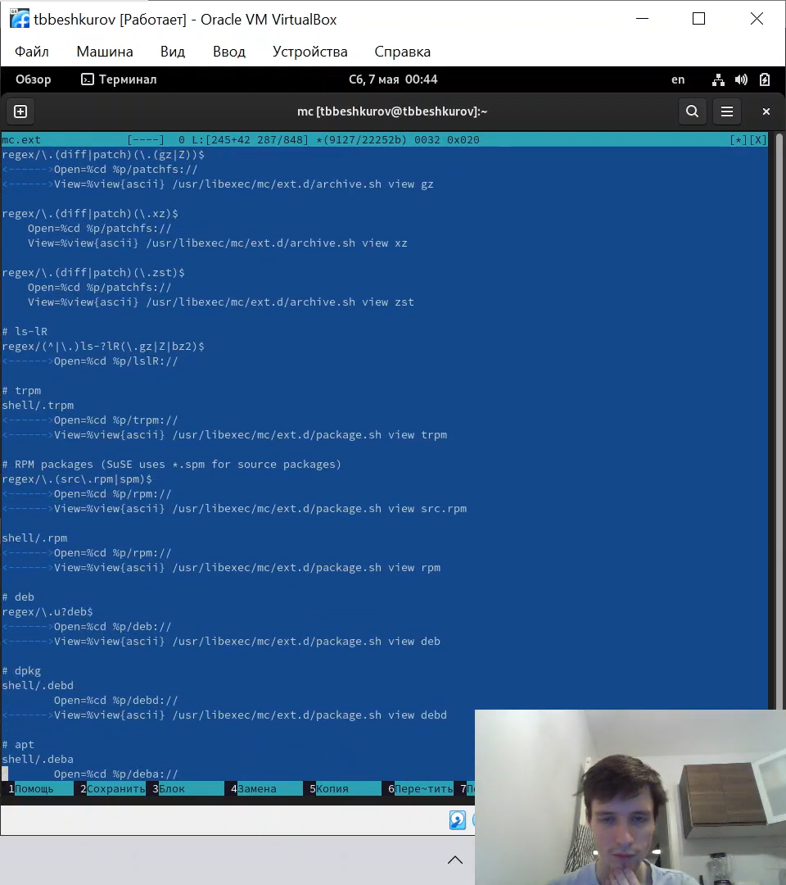
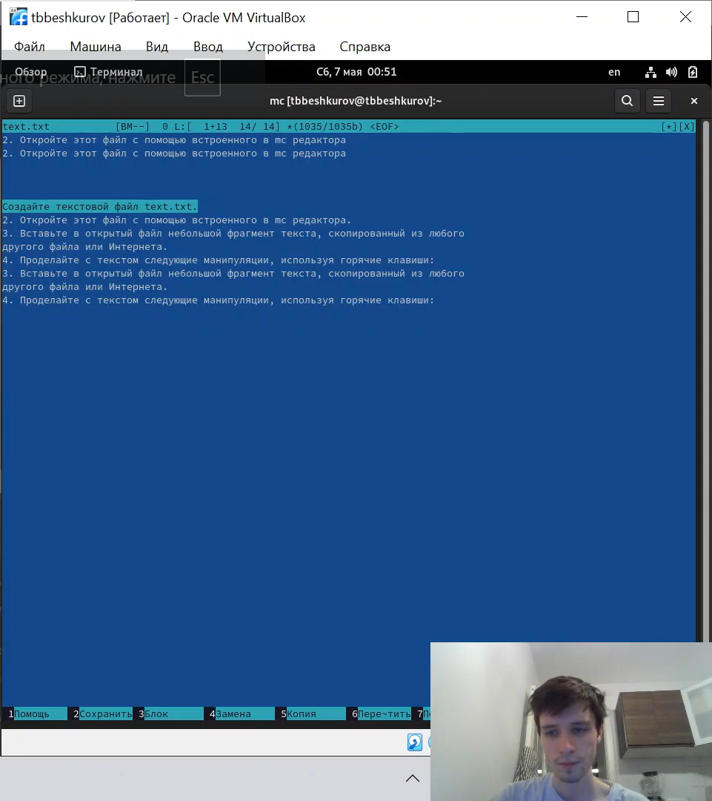
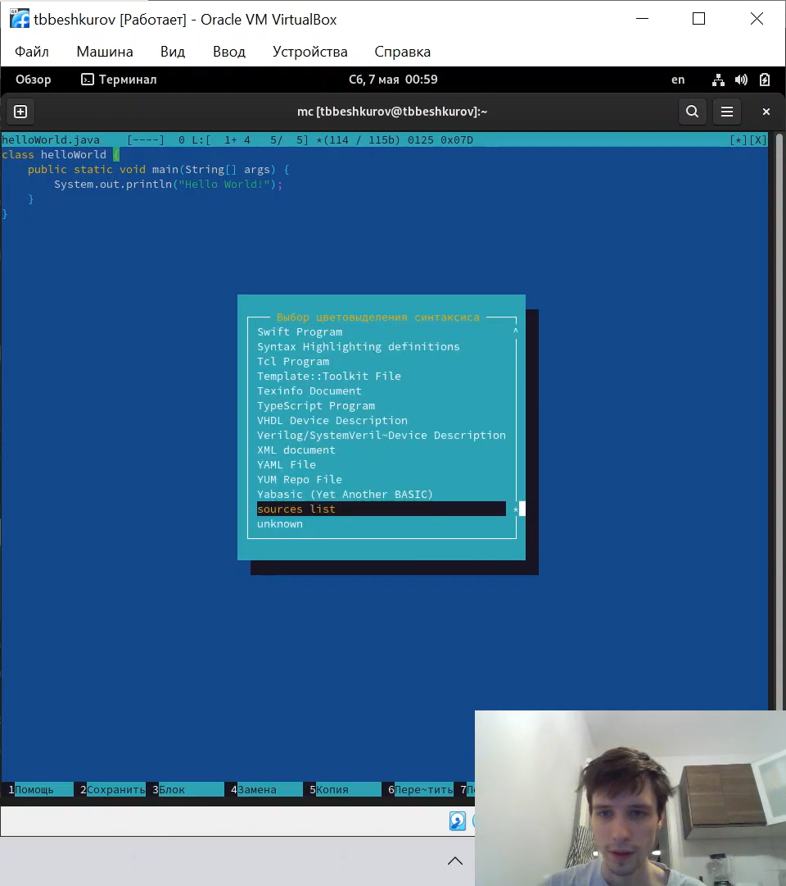

---
## Front matter
lang: ru-RU
title: Лабораторная работа №7
author: |
    Бешкуров Тимофей - студент группы НФИбд-01-21
date: 07.05.2022

## Formatting
toc: false
slide_level: 2
theme: metropolis
header-includes: 
 - \metroset{progressbar=frametitle,sectionpage=progressbar,numbering=fraction}
 - '\makeatletter'
 - '\beamer@ignorenonframefalse'
 - '\makeatother'
aspectratio: 43
section-titles: true
---

# Командная оболочка Midnight Commander

## Цель работы

Освоение основных возможностей командной оболочки Midnight Commander. Приобретение навыков практической работы по просмотру каталогов и файлов; манипуляций
с ними.

## Выполнение лабораторной работы

1. Изменение правой панели на дерево (рис.1)

{ #fig:001 width=90% }

##

2. Свойства файлов на правой панели (рис. 2)

{ #fig:002 width=90% }

##

3. Создание нового каталога (рис. 3)

{ #fig:003 width=90% }

##

4. Поиск файла .с со строкой внутри main (рис. 4) 

{ #fig:004 width=90% }

##

5. Файл меню (рис. 5)

{ #fig:005 width=90% }

##

6. Файл Расширений (рис. 6)

{ #fig:006 width=70% }

##

7. Работа с файлом (рис. 7)

{ #fig:007 width=70% }

##

8. Отмена цветовыделения (рис. 8)

{ #fig:008 width=70% }

## Вывод

Освоили основные возможности командной оболочки Midnight Commander. Приобрели навыки практической работы по просмотру каталогов и файлов; манипуляций с ними.