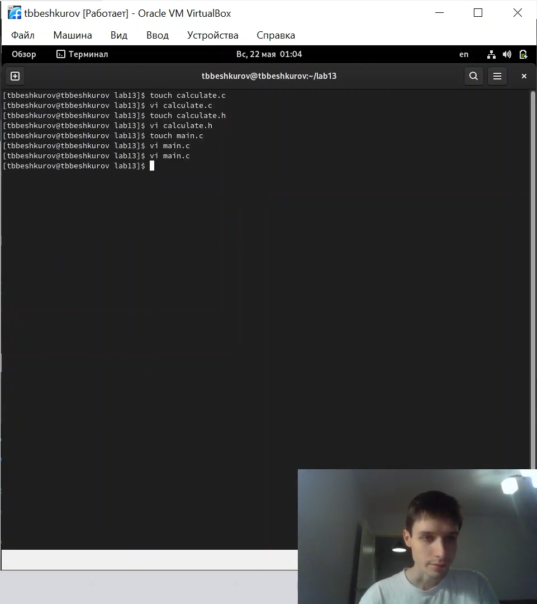
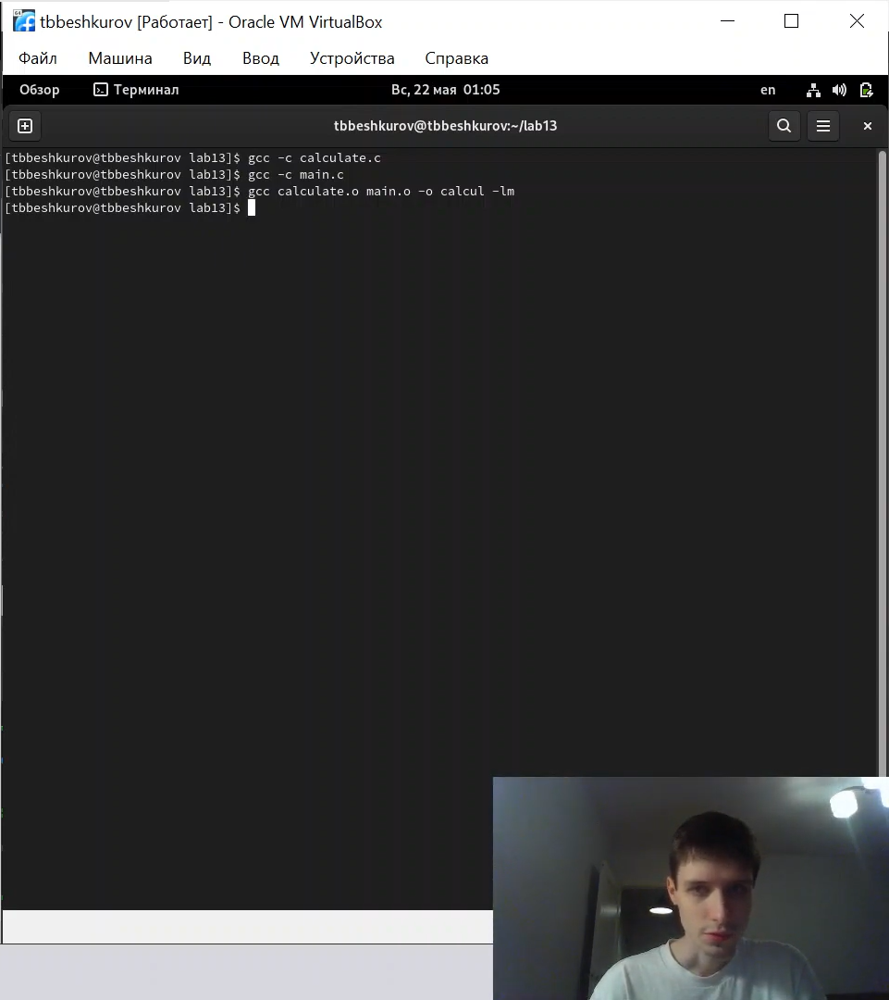
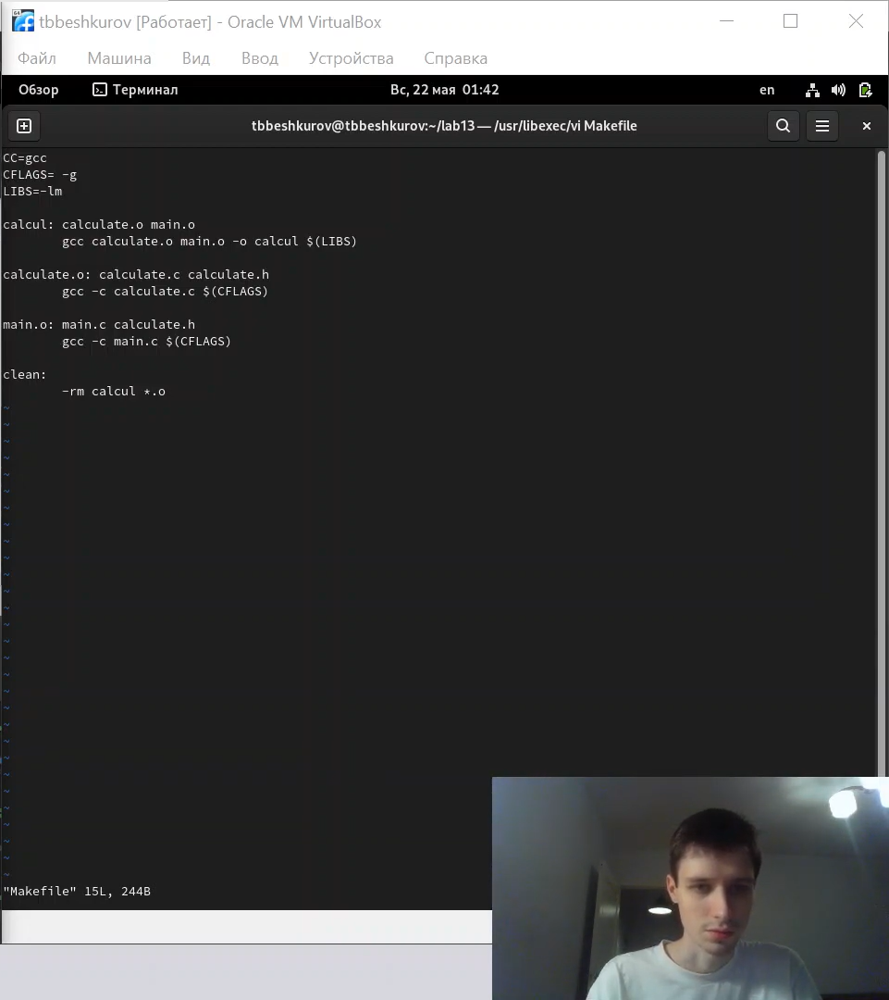
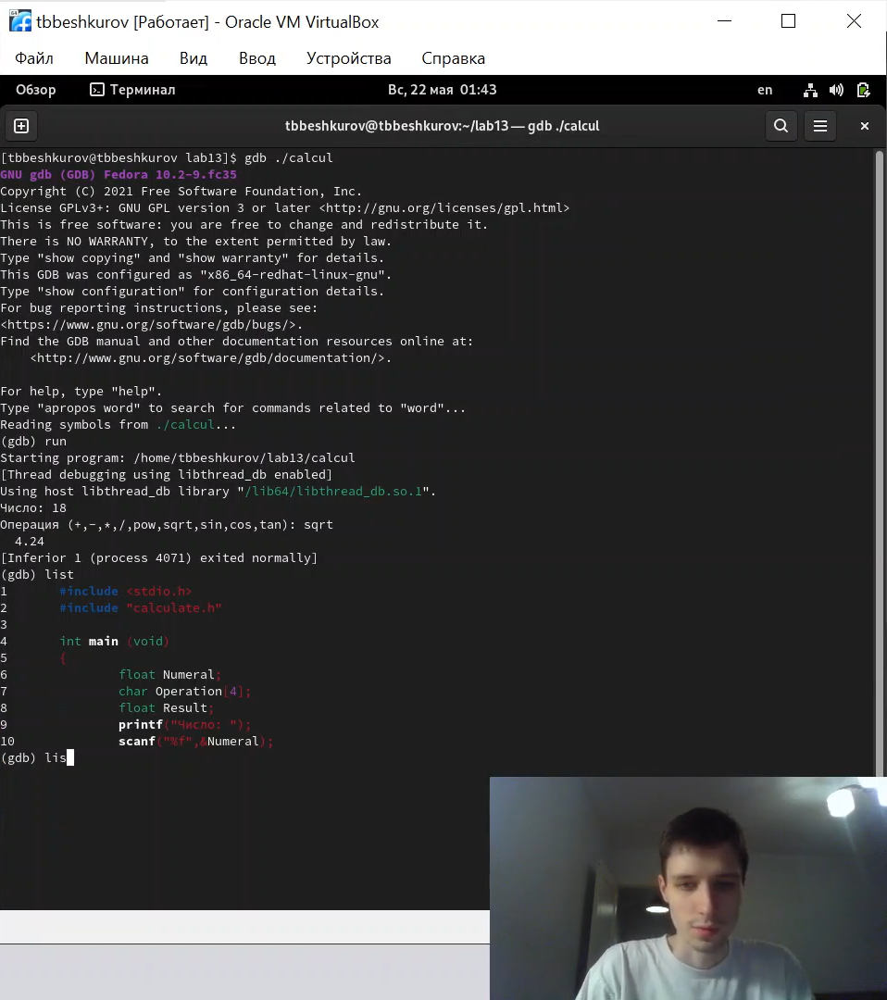
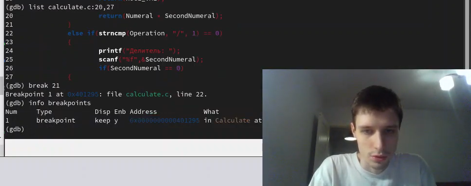
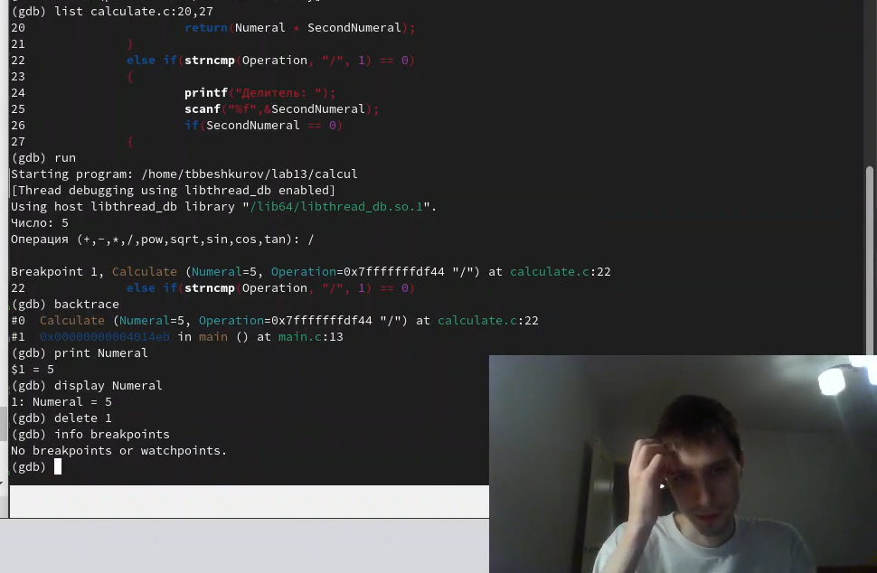
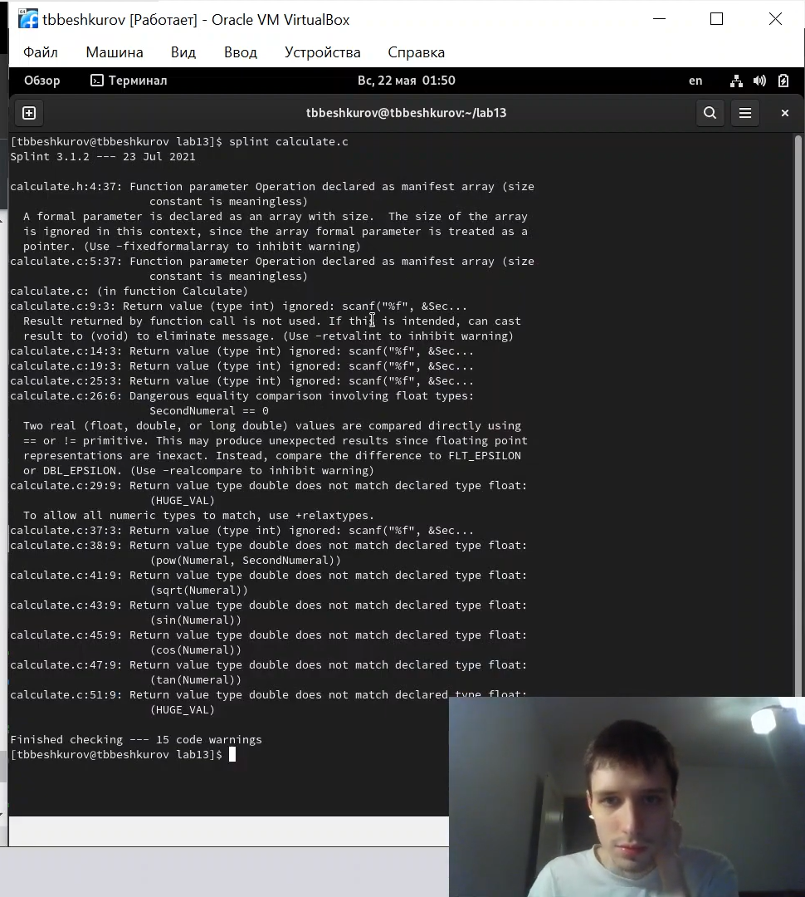

---
## Front matter
lang: ru-RU
title: Лабораторная работа №13
author: |
    Бешкуров Тимофей - студент группы НФИбд-01-21
date: 04.06.2022

## Formatting
toc: false
slide_level: 2
theme: metropolis
header-includes: 
 - \metroset{progressbar=frametitle,sectionpage=progressbar,numbering=fraction}
 - '\makeatletter'
 - '\beamer@ignorenonframefalse'
 - '\makeatother'
aspectratio: 43
section-titles: true
---

# Средства, применяемые при разработке программного обеспечения в ОС типа UNIX/Linux

## Цель работы

Приобрести простейшие навыки разработки, анализа, тестирования и отладки приложений в ОС типа UNIX/Linux на примере создания на языке программирования
С калькулятора с простейшими функциями.

## Выполнение лабораторной работы

1. Создание файлов (рис. 1)

{ #fig:001 width=90% }

##

Компилирование (рис. 2)

{ #fig:002 width=90% }

##

2. Изменение makefile (рис. 3)

{ #fig:003 width=90% }

##

3. Работа с gdb (рис. 4-6)

{ #fig:004 width=90% }

##

{ #fig:004 width=90% }

##

{ #fig:004 width=90% }

##

4. splint (рис. 5)

{ #fig:005 width=90% }

## Вывод

Приобрели простейшие навыки разработки, анализа, тестирования и отладки приложений в ОС типа UNIX/Linux на примере создания на языке программирования
С калькулятора с простейшими функциями.