---
## Front matter
lang: ru-RU
title: Индивидуальный проект. Этап 1
author: |
    Бешкуров Тимофей - студент группы НФИбд-01-21
date: 27.04.2022

## Formatting
toc: false
slide_level: 2
theme: metropolis
header-includes: 
 - \metroset{progressbar=frametitle,sectionpage=progressbar,numbering=fraction}
 - '\makeatletter'
 - '\beamer@ignorenonframefalse'
 - '\makeatother'
aspectratio: 43
section-titles: true
---

# Размещение шаблона hugo на github pages

## Цель работы

- Разместить шаблон hugo на github pages

## Выполнение лабораторной работы

Установили hugo и добавили его в PATH для удобства вызова из cmd

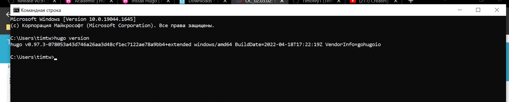

## 

Заходим на github с шаблоном и жмем конпку: "Использовать этот шаблон"

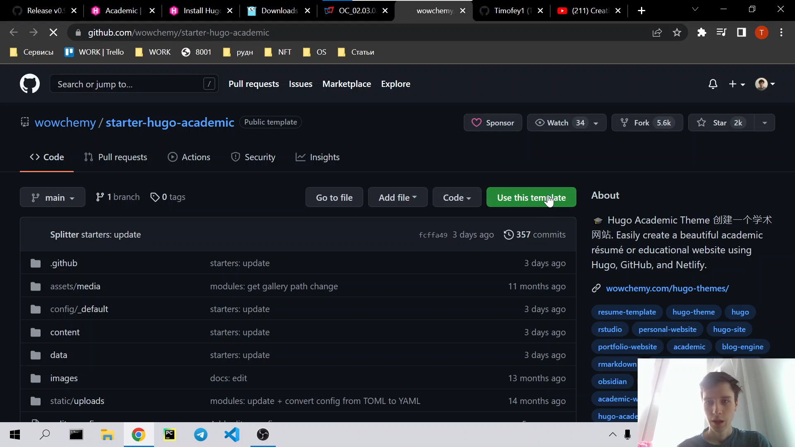

## 

Даем имя репозиторию и создаем его.

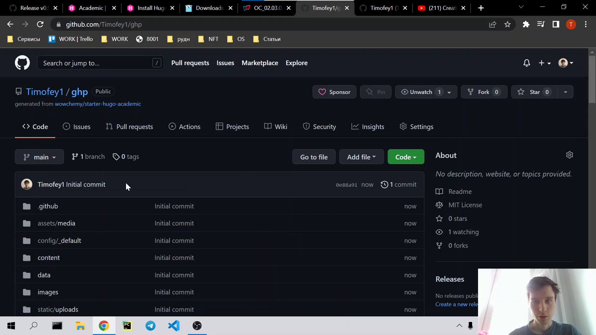

## 

Создаем новый репозиторий с именем <i>username</i>.github.io

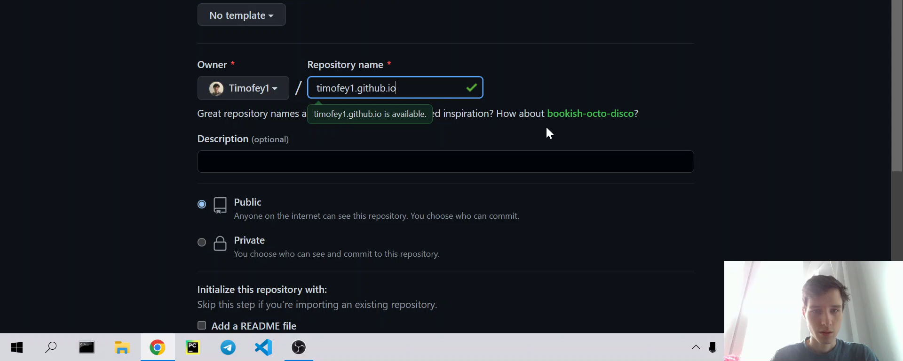

## 

Клонирум наш репозиторий с шаблоном.

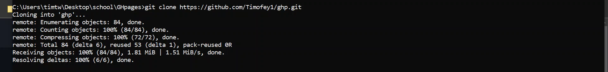

## 

Клонируем наш репозиторий для хранения static файлов и подготавливаем его 

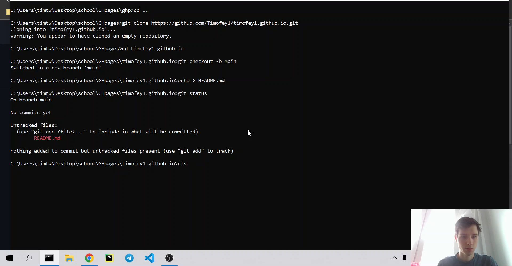

## 

Создаем подмодуль

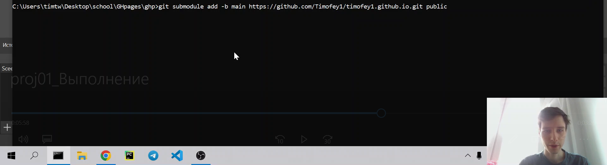

## 

Собираем сайт командой hugo

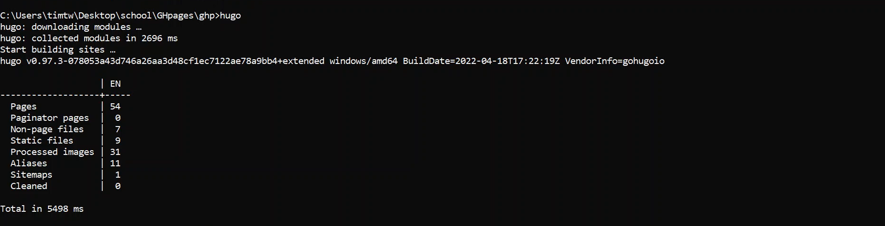

## 

Проверка папки public

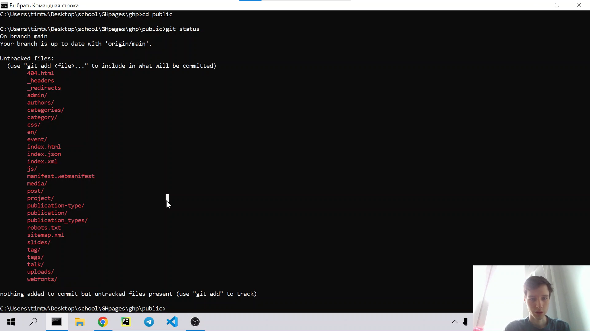

##

Загружаем это на сервер

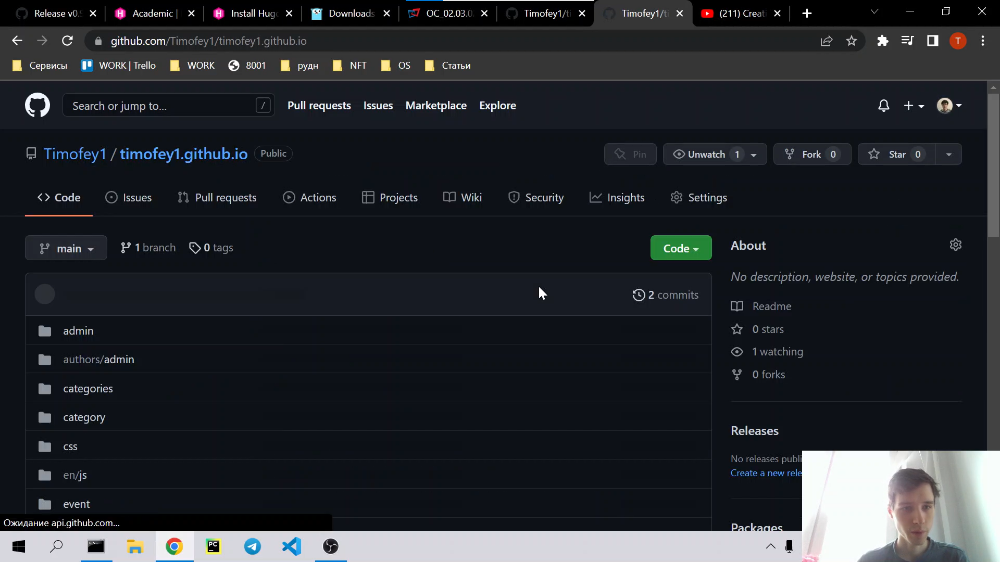

##

Заходим на наш сайт 

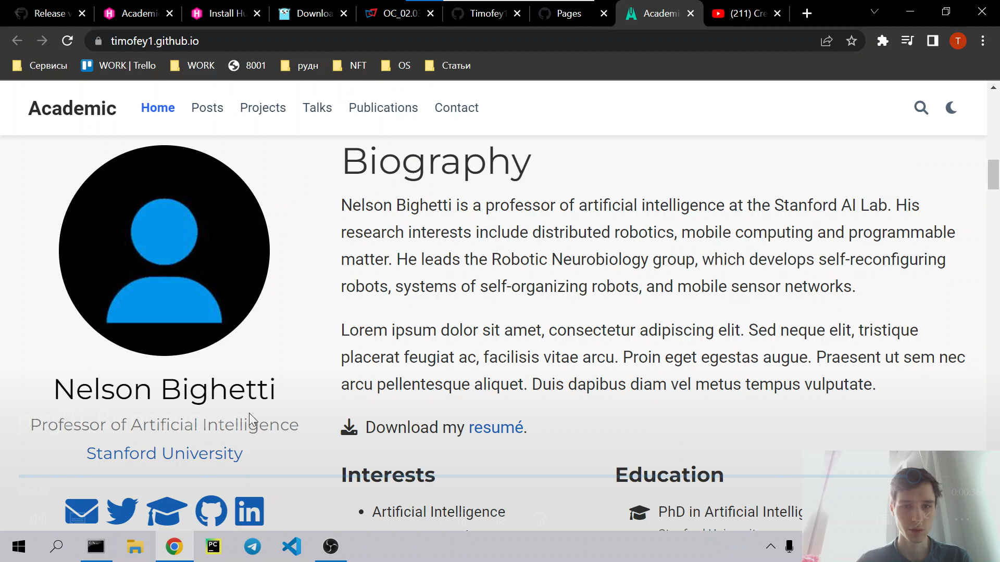

## Вывод

Разметили шаблон сайта hugo на github pages
