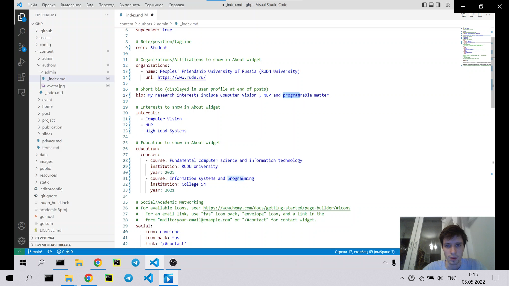
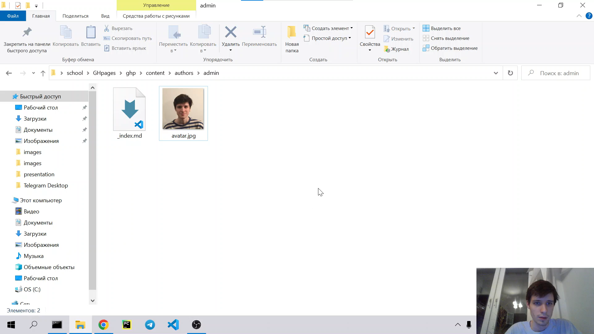
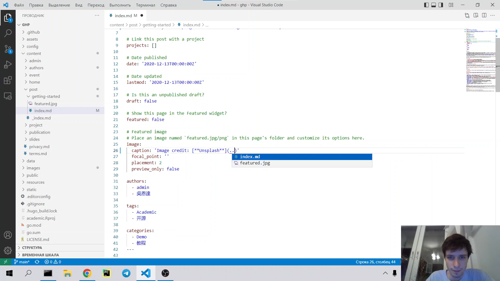

---
## Front matter
lang: ru-RU
title: Индивидуальный проект. Этап 2
author: |
    Бешкуров Тимофей - студент группы НФИбд-01-21
date: 05.05.2022

## Formatting
toc: false
slide_level: 2
theme: metropolis
header-includes: 
 - \metroset{progressbar=frametitle,sectionpage=progressbar,numbering=fraction}
 - '\makeatletter'
 - '\beamer@ignorenonframefalse'
 - '\makeatother'
aspectratio: 43
section-titles: true
---

# Работа с контентом на hugo

## Цель работы

Редактирование информации о себе. И создание поста.

## Выполнение лабораторной работы

1. Список добавляемых данных.
- Разместить фотографию владельца сайта.
- Разместить краткое описание владельца сайта (Biography).
- Добавить информацию об интересах (Interests).
- Добавить информацию от образовании (Education).

##
Редактирование файла `content/authors/admin/_index.md`

## 

Добавление фотографии в `content/authors/admin/`

## 

2. Добавление поста

## 

3. Сделать пост по прошедшей неделе.

Нам нужно обновить данные нашего сайта на github pages, чтобы все что мы сделали было не только на localhost.

Для этого воспользуемся командой `hugo` для сборки сайта, в папке `./public` появятся новые static файлы. Их необходимо будет отправить на гитхаб в репозиторий `<username>.github.io` командой `git push origin main`, предварительно добавив новые файлы (`git add .`) и создав новый коммит (`git commit -am "stage02"`).

## 

Результат.

## Вывод

Отредактировали информацию о себе (Biography, Interests, Education). А также добавили пост на тему контроль версий git.
