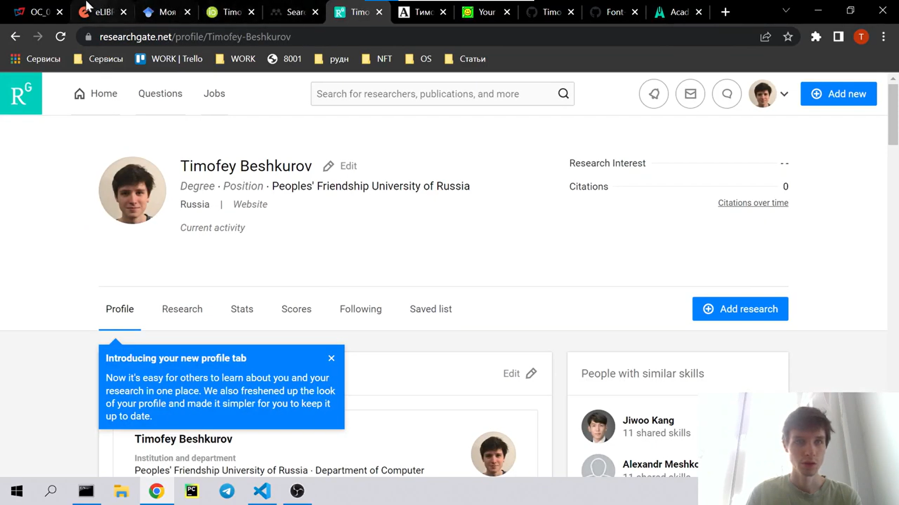
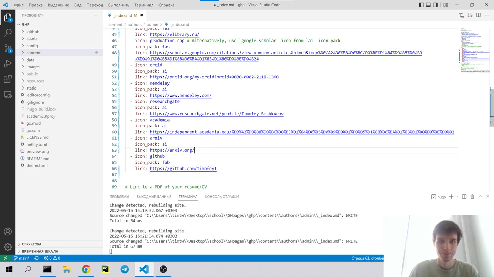
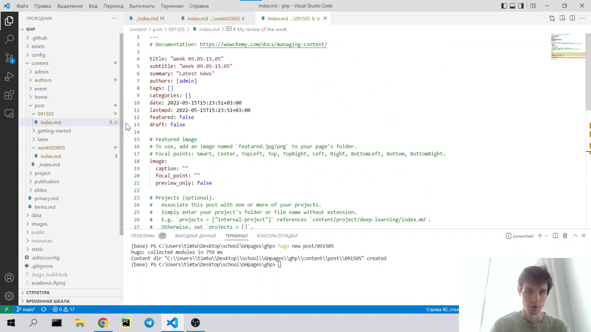
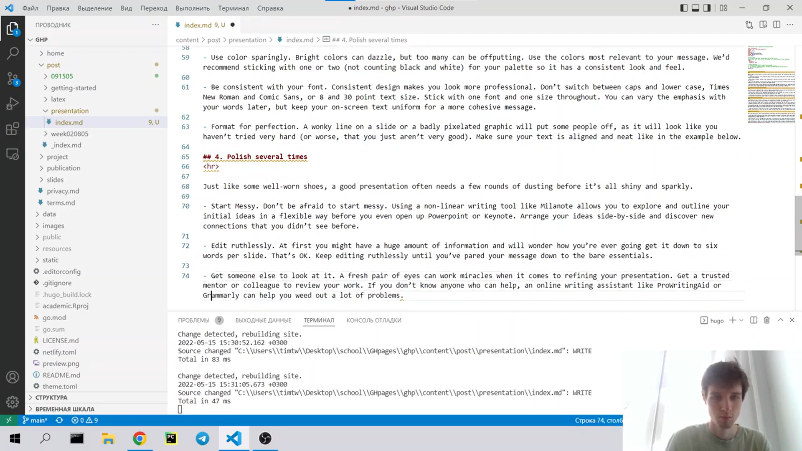

---
## Front matter
lang: ru-RU
title: Индивидуальный проект. Этап 4
author: |
    Бешкуров Тимофей - студент группы НФИбд-01-21
date: 19.05.2022

## Formatting
toc: false
slide_level: 2
theme: metropolis
header-includes: 
 - \metroset{progressbar=frametitle,sectionpage=progressbar,numbering=fraction}
 - '\makeatletter'
 - '\beamer@ignorenonframefalse'
 - '\makeatother'
aspectratio: 43
section-titles: true
---

# Добавление ссылок на литературные источники. Создание постов.

## Цель работы

Добавить к сайту ссылки на литературные источники. Сделать 2 поста: по прошедшей неделе и на тему "Создание презентации"

## Выполнение лабораторной работы

1. Зарегистрироваться на 8 ресурсах ресурсах (рис. 1)

{ #fig:001 width=90% }

##

2. В `./content/authors/admin/_index.md` добавить иконки ресурсов и ссылки (рис. 2).

{ #fig:002 width=90% }

##

3. Результат (рис.3).

{ #fig:003 width=90% }

##

4. Сделать пост по прошедшей неделе. (рис. 4)

{ #fig:004 width=90% }

##

5. Добавить пост на тему: Создание презентации (рис. 5)

{ #fig:005 width=90% }

## Вывод

Добавили к сайту ссылки на литературные источники. Сделали 2 поста: пост по прошедшей неделе и пост на тему "Создание презентации"
