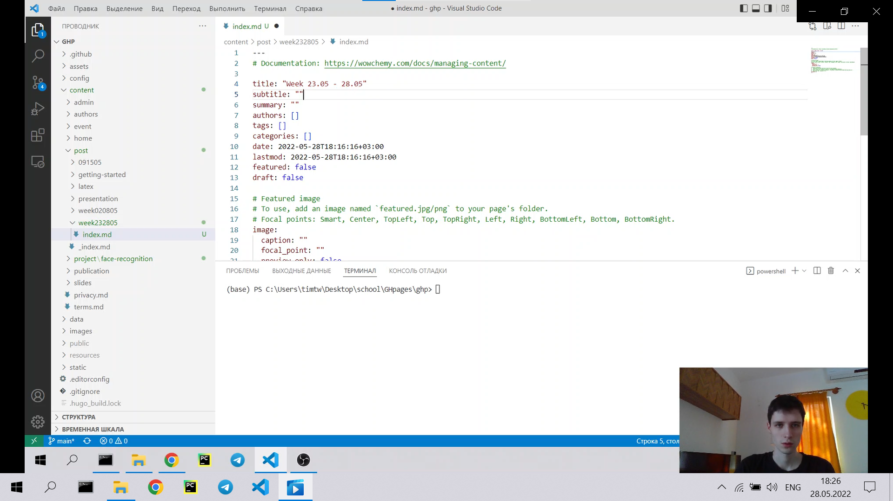
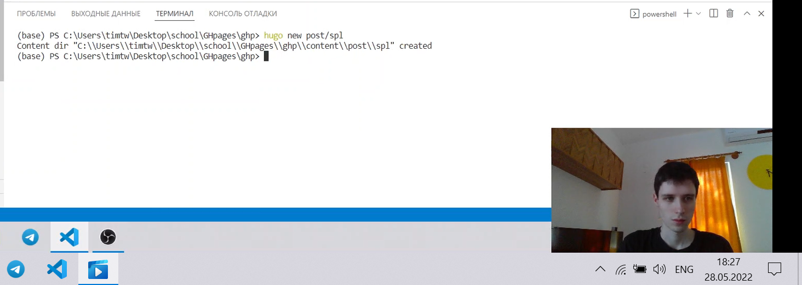

---
## Front matter
lang: ru-RU
title: Индивидуальный проект. Этап 5
author: |
    Бешкуров Тимофей - студент группы НФИбд-01-21
date: 19.05.2022

## Formatting
toc: false
slide_level: 2
theme: metropolis
header-includes: 
 - \metroset{progressbar=frametitle,sectionpage=progressbar,numbering=fraction}
 - '\makeatletter'
 - '\beamer@ignorenonframefalse'
 - '\makeatother'
aspectratio: 43
section-titles: true
---

# Добавление персонального проекта. Создание постов.

## Цель работы

Добавить к сайту персональный проект. Сделать 2 поста: по прошедшей неделе и на тему "Языки научного программирования."

## Выполнение лабораторной работы

1. Создание нового проекта (рис. 1)

{ #fig:001 width=90% }

##

2. Редактирование информации о проете (рис. 2).

{ #fig:002 width=90% }

##

3. Создание папки с постом за прошедшую неделю (рис.3).

{ #fig:003 width=90% }

##

4. Редактирование информации о посте за прошедшую неделю (рис. 4)

{ #fig:004 width=90% }

##

5. Создание папки с постом на тему "Языки научного программирования." (рис. 5)

{ #fig:005 width=90% }

##

6. Редактирование информации о посте на тему "Языки научного программирования." (рис. 6)

{ #fig:006 width=90% }

## Вывод

Добавили к сайту персональный проект. Сделали 2 поста: пост по прошедшей неделе и пост на тему "Языки научного программирования."
